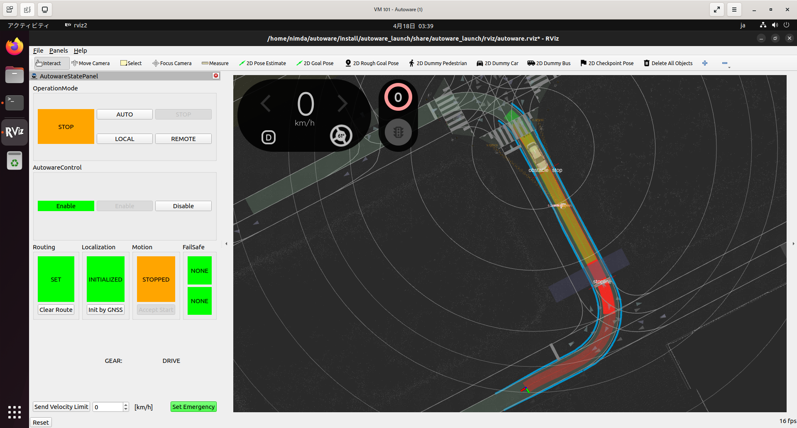

## 1. はじめに

Autoware は、Free/Libre and Open Source Software (FLOSS) の自動運転車ソフトウェアスタックであり、自動運転技術の研究開発と実装を加速させることを目的としています。Robot Operating System (ROS) を基盤として構築されており、センサーの統合、周囲環境の認識、局所的な経路計画、車両制御など、自動運転に必要な主要な機能を包括的に提供します。Autoware は、産業界や学術界で広く採用されており、リアルタイムでの運用能力や、様々な車両やセンサー構成に柔軟に対応できる設計が特徴です。また、現在は TIER IV と自動運転車の開発を進める研究者や技術者が中心となって、継続的な改良と拡張が行われています。

- Official Home Page：https://autoware.org/
- Official Docs：https://autowarefoundation.github.io/autoware-documentation/main/
- Official GitHub Repository：https://github.com/autowarefoundation/autoware

Autoware には、様々なディストリビューション [^1] が存在しています。Autoware.AI は 2015 年にリリースされた最初のディストリビューションであり、その後、多くの機能が追加されました。しかし、アーキテクチャの統一性やコードの品質には問題が残っていました。2019 年には、ROS 2 の登場に伴い、Autoware.Auto が開発され、システム設計や開発プロセスが全面的に見直されました。しかし、これによりコードの統合要求が厳格化され、開発の柔軟性や速度に影響が出ました。2022 年からは、これらの課題を解決するために新たなコンセプトである Autoware Core/Universe が提案され、Autoware は 2 つの異なる基準で管理される新しい方向へと進化しています。

- Autoware.AI：https://github.com/Autoware-AI
- Autoware.Auto：https://autowarefoundation.gitlab.io/autoware.auto/AutowareAuto/
- Autoware Core：https://github.com/autowarefoundation/autoware.core
- Autoware Universe：https://github.com/autowarefoundation/autoware.universe

[^1]: Autoware Documentation, How is Autoware Core/Universe different from [Autoware.AI](http://autoware.ai/) and Autoware.Auto?：https://autowarefoundation.github.io/autoware-documentation/main/design/autoware-concepts/difference-from-ai-and-auto/

Autoware をローカル環境にインストールする方法は 2 つあります。1 つ目は、公開されている Docker Image を Pull してローカル環境に展開する方法 [^2] です。2 つ目は、ソースコードをビルドしてインストールする方法です [^3] です。本記事では、2 つ目のソースコードをビルドしてインストールする方法について記述します。

[^2]: Docker installation：https://autowarefoundation.github.io/autoware-documentation/main/installation/autoware/docker-installation/

[^3]: Source installation：https://autowarefoundation.github.io/autoware-documentation/main/installation/autoware/source-installation/

本記事では、Proxmox 上に VM 作成し、Autoware をインストールします。作成する VM のスペックは以下の通りです。また、GPU はパススルーで運用しています。

| 項目 | 値                  |
| ---- | ------------------- |
| OS   | Ubuntu 22.04 LTS    |
| CPU  | 16 Core             |
| RAM  | 32 GB               |
| ROM  | 128 GB              |
| GPU  | GeForce RTX 4070 Ti |

## 2. パッケージをインストールする

まず初めに、Git をインストールし、GitHub で公開されている Autoware のリポジトリをローカル環境にクローンします。次に、Autoware のリポジトリ内に含まれる Ansible スクリプトを実行し、ROS 2 や NVIDIA CUDA などのパッケージをインストールします。

```bash
$ sudo apt update
$ sudo apt -y install git
$ git clone https://github.com/autowarefoundation/autoware.git
$ cd ~/autoware
$ ./setup-dev-env.sh -y
```

パッケージのインストールが完了したら再起動します。再起動後、`nvidia-smi` で GPU が認識されているか確認します。

```bash
$ nvidia-smi
+-----------------------------------------------------------------------------------------+
| NVIDIA-SMI 560.35.03              Driver Version: 560.35.03      CUDA Version: 12.6     |
|-----------------------------------------+------------------------+----------------------+
| GPU  Name                 Persistence-M | Bus-Id          Disp.A | Volatile Uncorr. ECC |
| Fan  Temp   Perf          Pwr:Usage/Cap |           Memory-Usage | GPU-Util  Compute M. |
|                                         |                        |               MIG M. |
|=========================================+========================+======================|
|   0  NVIDIA GeForce RTX 4070 Ti     Off |   00000000:00:10.0 Off |                  N/A |
|  0%   44C    P8              4W /  285W |      15MiB /  12282MiB |      0%      Default |
|                                         |                        |                  N/A |
+-----------------------------------------+------------------------+----------------------+

+-----------------------------------------------------------------------------------------+
| Processes:                                                                              |
|  GPU   GI   CI        PID   Type   Process name                              GPU Memory |
|        ID   ID                                                               Usage      |
|=========================================================================================|
|    0   N/A  N/A      1747      G   /usr/lib/xorg/Xorg                              4MiB |
+-----------------------------------------------------------------------------------------+
```

## 3. ワークスペースを構築する

次に、ワークスペースを構築します。ワークスペースは ROS 2 の概念であり、以下の 3 ツールを用いて構築します。これらのコマンドについて詳しく知りたい場合は、ROS 2 の公式ドキュメント [^4] [^5] を参照ください。

- VCS: リポジトリのクローンや管理を一括で行うツールで、複数の ROS 2 プロジェクトを効率的に扱うために使用されます
- rosdep: ROS 2 パッケージが依存するシステムライブラリやソフトウェアを自動でインストール・管理するツールです
- colcon: ROS 2 における複数のパッケージを並列にビルド・テストするためのビルドツールです

[^4]: Using colcon to build packages：https://docs.ros.org/en/humble/Tutorials/Beginner-Client-Libraries/Colcon-Tutorial.html

[^5]: Managing Dependencies with rosdep：https://docs.ros.org/en/humble/Tutorials/Intermediate/Rosdep.html

```bash
$ cd ~/autoware
$ mkdir src
$ vcs import src < autoware.repos
$ source /opt/ros/humble/setup.bash
$ rosdep update
$ rosdep install -y --from-paths src --ignore-src --rosdistro $ROS_DISTRO
$ colcon build --symlink-install --cmake-args -DCMAKE_BUILD_TYPE=Release
```

## 4. 実行動作を確認する

最後に、Autoware が起動するか確認します。Planning Simulation を実行するチュートリアルドキュメント [^5] を参考に、以下のコマンドを実行します。上記で構築したワークスペースには、マップデータが存在しません。そのため、マップデータをダウンロードする必要があります。ここでは、TIER IV が公開しているマップデータをダウンロードします。また、チュートリアルドキュメントに記載されている通り、`$HOME` をチルダにするとマップデータのロードに失敗するので注意が必要です。

[^5]: https://autowarefoundation.github.io/autoware-documentation/main/tutorials/ad-hoc-simulation/planning-simulation/

```bash
$ gdown -O ~/autoware_map/ 'https://docs.google.com/uc?export=download&id=1499_nsbUbIeturZaDj7jhUownh5fvXHd'
$ unzip -d ~/autoware_map ~/autoware_map/sample-map-planning.zip
$ source ~/autoware/install/setup.bash
$ ros2 launch autoware_launch planning_simulator.launch.xml \
		map_path:=$HOME/autoware_map/sample-map-planning\
		vehicle_model:=sample_vehicle \
		sensor_model:=sample_sensor_kit
```

ROS 2 のインストールと Autoware ワークスペースの構築が正常に完了していれば、可視化ツールである Rviz が起動するはずです。Rviz 内で `2D Pose Estimate` と `2D Goal Pose` を設定し、OperationMode を AUTO にすることにより、自動運転のシミュレーションが実行されます。これにより、Autoware のインストール作業が完了します。



## 5. おわりに

ここまで、Autoware をローカル環境にソースコードからインストールする方法について記述してきました。経験上、Node や Topic といった ROS 2 の基本概念やコマンドを知っておくと沼にハマるリスクを減らせると思います。そのため、ROS 2 が提供しているチュートリアル [^6] を、手元で動かしてみることをオススメします。

[^6]: Tutorials — ROS 2 Documentation: Humble documentation：https://docs.ros.org/en/humble/Tutorials.html
