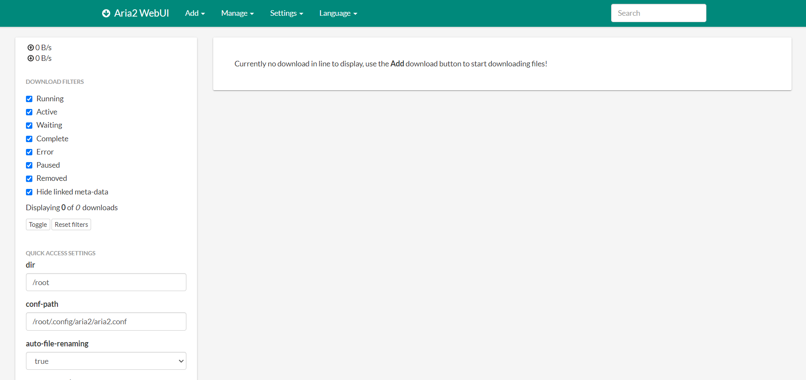

## 1. はじめに

WebUI-Aria2 は，Aria2 という軽量で多機能なコマンドラインベースのダウンロードユーティリティのためのウェブベースのユーザーインターフェースです。Aria2 は，HTTP/HTTPS，FTP，SFTP，BitTorrent，Metalink といったプロトコルをサポートしており，マルチコネクションダウンロードや分割ダウンロードを通じて高速ダウンロードを実現します。WebUI-Aria2 では，ブラウザを介してダウンロードタスクを簡単に設定，管理，監視することができます。これにより，ユーザーは Aria2 の強力な機能を直感的なグラフィカルインターフェースを通じて利用できるようになり，特に GUI が好まれるユーザーやシステム管理の簡易化を図りたい場合に便利です。WebUI-Aria2 は，リアルタイムでのダウンロード情報の更新，ダウンロードキューの管理，グローバル統計の表示など，基本的なダウンロード管理機能を提供します。

本記事では，WebUI-Aria2 をマニュアルでインストールする方法について記述します。筆者が調査した範囲では，日本語のインストールガイドが見つかりませんでした。また，公式のドキュメント [^1] も少々理解しづらいところがあるため，本記事で詳細なガイドを提供します。本記事で説明するインストール作業は，Ubuntu 22.04 LTS 環境下で実施されたものです。

[^1]: ziahamza/webui-aria2 - https://github.com/ziahamza/webui-aria2

## 2. インストールと実行

インストール作業としてはとてもシンプルです。まず初めに aria2 と Node.js をインストールする。次に Git リポジトリをクローンして WebUI-Aria2 と aria2 を実行するだけです。インストールコマンドと実行コマンドを以下に示します。

```bash
$ sudo apt update

# aria2 Install
$ sudo apt install git aria2 -y

# Node.js Install
$ wget -qO- https://raw.githubusercontent.com/nvm-sh/nvm/v0.39.5/install.sh | bash
$ source ~/.bashrc
$ nvm install node

$ git clone https://github.com/ziahamza/webui-aria2
$ cd webui-aria2
$ node node-server.js &
$ aria2c --enable-rpc --rpc-listen-all
```

WebUI-Aria2 と aria2 を実行したら，Web ブラウザで http://localhost:8888 にアクセスします。正常に実行されていると，以下のような画面が出力されると思います。



## 3. おわりに

ここまで，WebUI-Aria2 をマニュアルでインストールする方法について記述してきました。リポジトリ内に Dockerfile が含まれているので，ビルドしようとしたのですが，筆者の環境では正常にビルドが行えませんでした。有志の方々が Docker Image を Docker Hub で公開してくれているので，Docker で WebUI-Aria2 をインストールしたい人は試してみるといいかもしれません。
