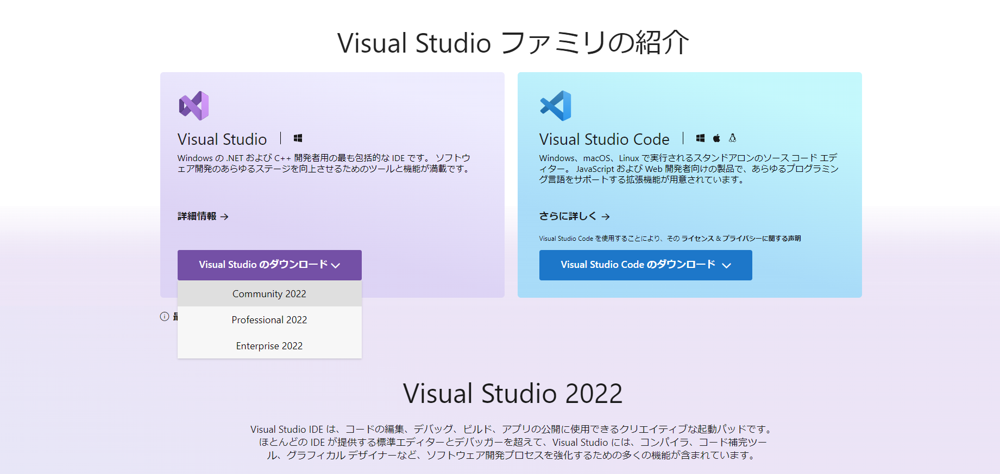
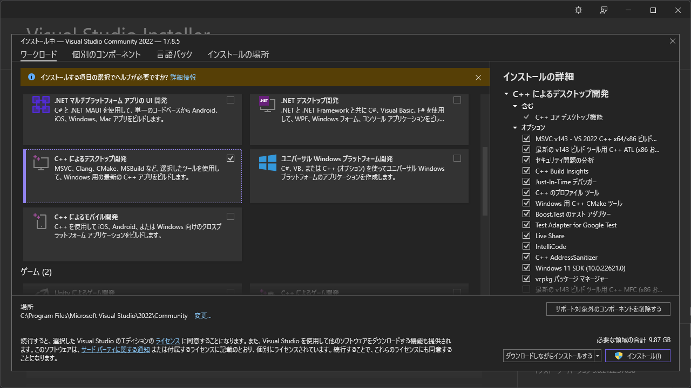
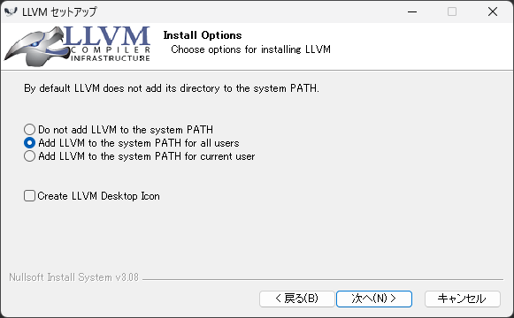

## 1. はじめに

Scala Native は、Scala のソースコードを機械語に変換するネイティブコードコンパイラです。Scala Native は、LLVM (Low Level Virtual Machine) プロジェクトを基盤としており、LLVM のツールチェーンを利用して、Scala のソースコードから直接ネイティブバイナリを生成します。このアプローチにより、生成されたバイナリは、OS に直接インストール可能な形式であり、高速な起動時間と効率的な実行が可能になります。

一応、Scala Native の公式ドキュメント [^1] に Windows に Scala Native の開発環境を構築する方法が記述されていますが、あまり詳しく記述されていません。また、日本語で書かれた情報が見つからなかったので備忘録として残しておきます。以降の作業は、Windows 11 Home 23H2 上で行いました。

[^1]: Environment setup — Scala Native 0.4.17 documentation：https://scala-native.org/en/stable/user/setup.html

## 2. Scala の開発環境構築

まず初めに、Scala の開発環境を構築します。既に、Scala の開発環境を構築している人は、本章を飛ばしてください。執筆時点では、[Coursier](https://get-coursier.io/) というアーティファクトマネジャーを用いて Scala の開発環境を構築することがデファクトスタンダードになっています。Windows の場合は[インストーラー](https://github.com/coursier/launchers/raw/master/cs-x86_64-pc-win32.zip)をダウンロードしてインストールすれば JDK のインストールから PATH 設定、ツールチェーンのインストールまで一括でやってくれます。インストールが完了したら念のため、PowerShell で正常にインストールできたか確認してみましょう。インストールした時期によってインストールされるバージョンが異なると思うので、PATH が通っていれば OK ぐらいで大丈夫です。

```powershell
PS > cs version
2.1.8
PS >cs java --version
openjdk 17 2021-09-14
OpenJDK Runtime Environment Temurin-17+35 (build 17+35)
OpenJDK 64-Bit Server VM Temurin-17+35 (build 17+35, mixed mode, sharing)
PS > scala-cli --version
Scala CLI version: 1.1.1
Scala version (default): 3.3.1
```

## 3. Visual Studio のインストール

Scala Native を動作させるためには、C/C++ のツールチェーンが必要です。公式ドキュメント [^1] では、Visual Studio Installer を介して、これらのツールチェーンをインストールしています。本記事でも、公式ドキュメントに沿った方法で、C/C++ のツールチェーンをインストールします。

まず初めに、Visual Studio の[公式サイト](https://visualstudio.microsoft.com/) から Visual Studio Community 2022 のインストーラーをダウンロードしてインストールします。Scala Native の公式ドキュメントでは Visual Studio Community 2019 をダウンロードしてインストールすると記述されていますが、どちらでも問題ないと思います。



インストールが完了したら Visual Studio Installer を起動します。タブの「ワークロード」から「C++によるデスクトップ開発」にチェックを入れてインストールします。既に、Visual Studio Community 2022 をインストールしている人は、Visual Studio Installer を起動し、Visual Studio Community 2022 の「変更」ボタンをクリックすると以下の画面に遷移すると思います。



## 4. LLVM のインストール

次に、LLVM をインストールします。LLVM は、GitHub でインストーラーが公開されているので[リリースページ](https://github.com/llvm/llvm-project/releases)から Windows 用のインストーラーをダウンロードしてインストールします。Scala Native の公式ドキュメントでは、LLVM-12.0.1-win64.exe 以降のバージョンを選択してくださいと記述されているので、執筆時点で最新版の LLVM Ver.17.0.6 のインストーラーをダウンロードしてインストールします。


ダウンロードしたインストーラーを起動します。「Windows によって PC が保護されました」と表示される可能性がありますが、無視して「詳細情報」をクリックして「実行」をクリックします。進んでいくと、Install Options で PATH を通すか聞かれます。「Do not add LLVM to the system PATH」を選択すると自分で PATH を通さないといけません。面倒くさいので「Add LLVM t the system PATH for all users」か「「Add LLVM t the system PATH for current user」を選択してインストーラーに PATH を通してもらいましょう。あとは、先に進んで「インストール」をクリックすれば LLVM のインストール作業は完了です。



## 5. 動作確認

最後に、Scala Native の開発環境が正常に構築されたか確かめるために、Scala のソースコードを EXE ファイルに変換します。以下のソースコードを任意の場所に保存します。内容としては、起動するとターミナルに "Click enter to exit" が表示され、エンターキーを押すと終了する簡単なプログラムです。Scala Native の公式ドキュメントでは sbt を用いてコンパイルしていますが、少し手間なので、本記事では Scala CLI を用いてコンパイルしています。Scala CLI は、第 2 章の手順通りに作業していれば Coursier を介して自動的にインストールされています。そのため、別途インストールする必要はありません。

```scala title="Hello.scala" {numberLines: true}
object Hello extends App {
  println("Click enter to exit")
  scala.io.StdIn.readLine()
}
```

PowerShell で、以下のコマンドを実行すると Scala のソースコードがコンパイルされて Hello.exe が出力されます。出力された Hello.exe を実行すると "Click enter to exit" と表示され、エンターキーを押すと終了します。Hello.exe を直接ダブルクリックしても起動することが出来ます。ここでは、Scala CLI の詳しいコマンドは割愛します。詳しく知りたい方は Scala CLI の公式ドキュメント [^2] を参照ください。

[^2]: Overview | Scala CLI：https://scala-cli.virtuslab.org/docs/overview

※ 執筆時点 (2024-01-23) では、コンパイル中に非推奨関数の sscanf と getenv に関するエラーが出力されますがコンパイル自体は正常に実行されるので以下では省略しています

```powershell
PS > scala-cli --power package Hello.scala --native
[info] Linking (1454 ms)
[info] Checking intermediate code (quick) (91 ms)
[info] Discovered 694 classes and 3849 methods
[info] Optimizing (debug mode) (1072 ms)
[info] Generating intermediate code (858 ms)
[info] Produced 8 files
[info] Compiling to native code (6330 ms)
[info] Total (10160 ms)
Wrote C:\Users\[USER]\Hello.exe, run it with
  .\Hello.exe
PS > .\Hello.exe
Click enter to exit
```

## 6. おわりに

ここまで、Windows に Scala Native の開発環境を構築する方法について記述してきました。これから、Windows で Scala Native を触ってみたい人の参考になれば幸いです。世間では、Scala は JVM 言語であるという印象が強いと思います。実際は、Scala Native の他にも、Scala のソースコードを JavaScript に変換する Scala.js が活発に開発されていたりと、Scala はマルチプラットフォーム言語として日々進化しています。現時点では、Scala Native や Scala.js に対応したエコシステムが、まだまだ成熟途中なので、実運用で活用するのは難しいと思います。将来的に、一度 Scala でソースコードを書けば、マルチプラットフォームに対応できるようになれば魅力的だと思います。
